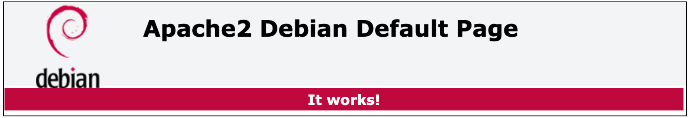
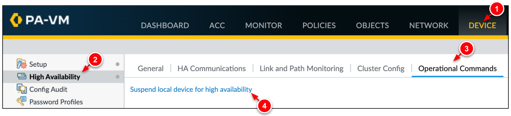
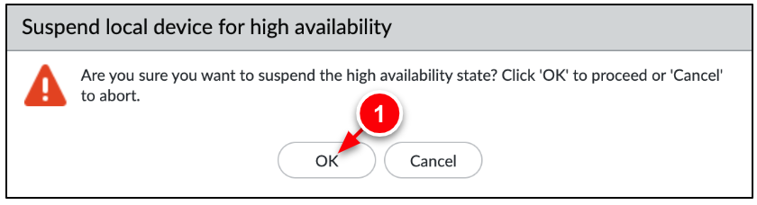
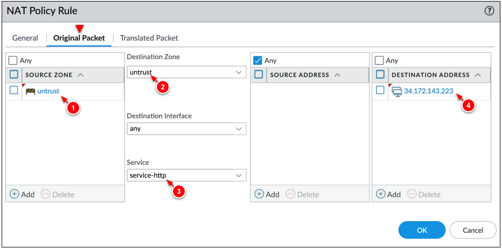
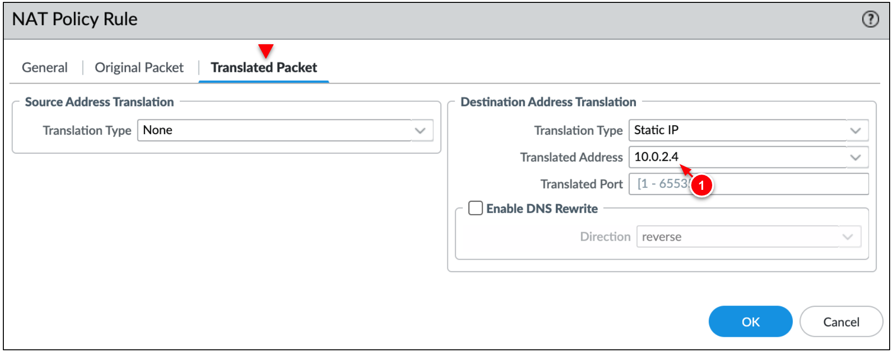
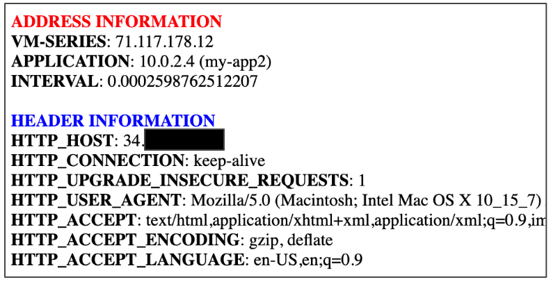

# VM-Series Active/Passive HA on Google Cloud

This tutorial creates a pair of Active/Passive VM-Series firewalls on Google Cloud.   This architecture provides the following benefits:
* Configuration sync between the VM-Series firewalls.
* State synchronization between instances to maintain state on failover.


The autoscale architecture is recommended in most use-cases.  Please see [VM-Series on Google Cloud](https://cloud.google.com/architecture/partners/palo-alto-networks-ngfw) for more information on VM-Series deployment models.


## Architecture

This deployment model provides solutions for the following key use-cases:

* IPSec termination of site-to-site VPNs.
* Legacy applications that need visibility of the original source client IP (No SNAT solution) for inbound traffic flows.
* Requirements for session fail-over on failure of VM-Series.


## Prepare for deployment

1. Enable the required APIs, generate an SSH key, and clone the repository. 

    ```
    gcloud services enable compute.googleapis.com
    ssh-keygen -f ~/.ssh/vmseries-tutorial -t rsa
    git clone https://github.com/PaloAltoNetworks/google-cloud-vmseries-ha-tutorial
    cd google-cloud-vmseries-ha-tutorial
    ```

2. Create a `terraform.tfvars` file.

    ```
    cp terraform.tfvars.example terraform.tfvars
    ```

3. Edit the `terraform.tfvars` file and set values for the following variables:

    | Variable      | Description                                    |
    |-----------------|----------------------------------------------------------------------------------|
    | `project_id `     | Set to your Google Cloud deployment project.                                     |
    | `public_key_path` | Set to match the full path you created previously.                               |
    | `mgmt_allow_ips`  | Set to a list of IPv4 ranges that can access the VM-Series management interface. |
    | `prefix`          | (Optional) If set, this string will be prepended to the created resources.       |
    | `vmseries_image_name`          | (Optional) Defines the VM-Series image to deploy.  A full list of images can be found [here](https://docs.paloaltonetworks.com/vm-series/11-0/vm-series-deployment/set-up-the-vm-series-firewall-on-google-cloud-platform/deploy-vm-series-on-gcp/use-custom-templates-or-the-gcloud-cli-to-deploy-the-vm-series-firewall).       |

4. (Optional) If you are using BYOL image (i.e. `vmseries-flex-byol-*`), the license can be applied during deployment by adding your VM-Series authcode to `bootstrap_files/authcodes`.
5. Save your `terraform.tfvars` file.


## Deployment
When no further changes are necessary in the configuration, deploy the resources:

1. Initialize and apply the Terraform plan.  

    ```
    terraform init
    terraform apply
    ```

2. Enter `yes` to start the deployment.
   
3. After all the resources are created, Terraform displays the following message:

    ```
    Apply complete!

    Outputs:

    EXTERNAL_LB_IP     = "ssh paloalto@1.1.1.1 -i ~/.ssh/vmseries-tutorial"
    EXTERNAL_LB_URL    = "https://1.1.1.1"
    VMSERIES_ACTIVE    = "https://2.2.2.2"
    VMSERIES_PASSIVE   = "https://3.3.3.3"
    VMSERIES_SSH       = "ssh admin@1.1.1.1 -i ~/.ssh/vmseries-tutorial" 
    ```

## Access the Active VM-Series Firewall

To access the VM-Series user interface, a password must be set for the `admin` user.

> [!CAUTION]  
> After the Terraform apply completes, it may take an additional 10 minutes for the VM-Series to become responsive.

1. SSH to the *active* VM-Series firewall using the `VMSERIES_SSH` output value. 

    ```
    ssh admin@1.1.1.1 -i ~/.ssh/vmseries-tutorial"
    ```

2. On the *active* VM-Series, set a password for the `admin` username. 

    ```
    configure
    set mgt-config users admin password
    ```

3. Commit the changes.

    ```
    commit
    ```

4. Enter `exit` twice to terminate the session.


## Test the Deployment

We can now test the deployment by accessing the `workload-vm` that resides in the trust VPC network.  All of the `workload-vm` traffic is routed directly through the VM-Series HA pair. 

1. Use the output `EXTERNAL_LB_URL` to access the web service on the `workload-vm` through the VM-Series firewall.

    

2. Use the output `EXTERNAL_LB_SSH`  to open an SSH session through the VM-Series to the `workload-vm`.  
    ```
    ssh paloalto@1.1.1.1 -i ~/.ssh/vmseries-tutorial
    ```

3. On the workload VM, run a preloaded script to test the failover mechanism across the VM-Series firewalls.
    ```
    /network-check.sh
    ```

    You will see output like this where `x.x.x.x` is the IP address is `EXTERNAL_LB_IP` address.
    ```
    Wed Mar 12 16:40:18 UTC 2023 -- Online -- Source IP = x.x.x.x
    Wed Mar 12 16:40:19 UTC 2023 -- Online -- Source IP = x.x.x.x
    Wed Mar 12 16:40:20 UTC 2023 -- Online -- Source IP = x.x.x.x
    Wed Mar 12 16:40:21 UTC 2023 -- Online -- Source IP = x.x.x.x
    ```

4. Login to the VM-Series firewalls using the `VMSERIES_ACTIVE` and `VMSERIES_PASSIVE` output values.
    ```
    UN: admin
    PW: Pal0Alt0@123 
    ```

5. After login, take note of the HA Status in the bottom right corner on each firewall.

    <b>Active Firewall</b></br>
    

    <b>Passive Firewall</b></br>
    

6. Perform a user initiated failover.
   1. On the ***Active Firewall***, go to the **Device → High Availability → Operational Commands**.
   2. Click **Suspend local device for high availability**.
        
   3. When prompted, click **OK** to initiate the failover.</br>
        


7. You should notice your SSH session to the `workload-vm` is still active.  This indicates the session successfully failed over between the VM-Series firewalls.  The script output should also display the same source IP address.
    ```
    Wed Mar 12 16:47:18 UTC 2023 -- Online -- Source IP = x.x.x.x
    Wed Mar 12 16:47:19 UTC 2023 -- Online -- Source IP = x.x.x.x
    Wed Mar 12 16:47:21 UTC 2023 -- Offline
    Wed Mar 12 16:47:22 UTC 2023 -- Offline
    Wed Mar 12 16:47:23 UTC 2023 -- Online -- Source IP = x.x.x.x
    Wed Mar 12 16:47:24 UTC 2023 -- Online -- Source IP = x.x.x.x
    ```

## (Optional) Onboard Internet Applications
You can secure multiple internet facing applications through the VM-Series firewall. This is done by mapping the addreses/ports from external forwarding rules to NAT policies defined on the VM-Series firewall.

In this section, onboard a new web application by creating a forwarding rule on the external load balancer along with a corresponding NAT policy on the VM-Series. 


### Create an application VM
In Cloud Shell, deploy new virtual machine (`app-vm`) to a subnet within the trust VPC network.  The `app-vm` installs a simple web application through its metadata startup script (`/scripts/app_startup.sh`).

1. In Cloud Shell, set environment variables for your `PROJECT_ID`, `REGION`, `ZONE`, & `SUBNET` for the application environment.

    <p><pre>
    export <i><b>PROJECT_ID</b>=YOUR_PROJECT_ID</i>
    export <i><b>REGION</b>=YOUR_REGION</i>
    export <i><b>ZONE</b>=YOUR_ZONE</i>
    export <i><b>SUBNET</b>=SUBNET_NAME</i></pre></p>
    
    > The `app-vm` can be deployed to any subnet in the `trust-vpc`, or to any VPC connected & routed to the `trust-vpc` (i.e. VPC peering).


2. Create the `app-vm` virtual machine. 

    ```
    gcloud compute instances create app-vm \
        --project=$PROJECT_ID \
        --network-interface subnet=$SUBNET,no-address \
        --zone=$ZONE \
        --machine-type=n2-standard-2 \
        --image-project=debian-cloud \
        --image-family=debian-11 \
        --metadata startup-script-url=https://raw.githubusercontent.com/PaloAltoNetworks/google-cloud-vmseries-ha-tutorial/main/scripts/app_startup.sh
    ```

3. Record the `INTERNAL_IP` address of the new virtual machine.

    **Output**
    <p><pre>
    NAME: app-vm
    ZONE: us-central1-a
    MACHINE_TYPE: f1-micro
    PREEMPTIBLE:
    INTERNAL_IP: <i><b>10.0.2.4</b></i>
    EXTERNAL_IP:
    STATUS: RUNNING</pre></p>

> [!NOTE]
> In the VM-Series NAT policy, the `INTERNAL_IP` will be set as the *translated* packet's destination address.  

### Create Forwarding Rule
Create a forwarding rule (`fwd-rule-app-vm`) on the external load balancer.  This rule will be used to distribute internet inbound traffic destined to the `app-vm` through the VM-Series untrust interfaces. 

1. Assign the name of the external load balancer's backend service to an environment variable named `EXTERNAL_LB`.

    ```
    export EXTERNAL_LB=$(gcloud compute backend-services list \
        --filter="loadBalancingScheme:EXTERNAL" \
        --format="get(name)")

    echo $EXTERNAL_LB
    ```

2. Create a new forwarding rule on the external load balancer.

    ```
    gcloud compute forwarding-rules create fwd-rule-app-vm \
        --load-balancing-scheme=EXTERNAL \
        --region=$REGION \
        --ip-protocol=L3_DEFAULT \
        --ports=ALL \
        --backend-service=$EXTERNAL_LB
    ```

    
3. Retrieve the forwarding rule's address.

    ```
    gcloud compute forwarding-rules describe fwd-rule-app-vm \
        --region=$REGION \
        --format='get(IPAddress)'
    ```
    
> [!NOTE]
> In the VM-Series NAT policy, the forwarding rule address will be set as the *original* packet's destination address.  

### Create NAT Policy
On the VM-Series, create a NAT policy to translate traffic destined the forwarding rule (`fwd-rule-app-vm`) to the internal IPv4 address of the `app-vm` IP address (i.e. `10.0.2.4`).

1. On the *active* VM-Series, go to **Policies → NAT**.  

2. Click **Add** and enter a name for the rule (i.e. `inbound-app-vm`). 

2. Configure the **Original Packet** as follows:

    | Field                   | Value                                                        |
    | ----------------------- | ------------------------------------------------------------ |
    | **Source Zone**         | `untrust`                                                    |
    | **Destination Zone**    | `untrust`                                                    |
    | **Service**             | `service-http`                                               |
    | **Destination Address** | The forwarding rule's IPv4 adddress (i.e. `34.172.143.223`). |

    

3. In the **Translated Packet** tab, configure the **Destination Address Translation** as follows:

    | Field                  | Value                                               |
    | ---------------------- | --------------------------------------------------- |
    | **Translation Type**   | `Static IP` or `Dynamic IP`                         |
    | **Translated Address** | The `INTERNAL_IP` of the `app-vm` (i.e. `10.0.2.4`) |

    

4. Click **OK** to create the rule.

5. Click **Commit** to apply the changes.

6. After the commit completes, access the sample application using the address of the forwarding rule.
    ```
    http://34.172.143.223
    ```
    

7. On the *active* VM-Series, go to **Monitor → Traffic** to view the traffic destined to the `app-vm`. 


## Clean up

To avoid incurring charges to your Google Cloud account for the resources you created in this tutorial, delete all the resources when you no longer need them.

1. (Optional) If you did the **Onboard Internet Applications** section, delete the forwarding rule (`fwd-rule-app-vm`) and application VM (`app-vm`).
    
    ```
    gcloud compute forwarding-rules delete fwd-rule-app-vm \
        --region=$REGION \
        --quiet

    gcloud compute instances delete app-vm \
        --zone=$ZONE \
        --quiet
    ```

2. Run the following command to delete the resources.

    ```
    terraform destroy
    ```
    
    Enter `yes` to delete the resources.

3. After all the resources are deleted, Terraform displays the following message.

    ```
    Destroy complete!
    ```

## Additional information

* Learn about the[ VM-Series on Google Cloud](https://docs.paloaltonetworks.com/vm-series/10-2/vm-series-deployment/set-up-the-vm-series-firewall-on-google-cloud-platform/about-the-vm-series-firewall-on-google-cloud-platform).
* Getting started with [Palo Alto Networks PAN-OS](https://docs.paloaltonetworks.com/pan-os). 
* Read about [securing Google Cloud Networks with the VM-Series](https://cloud.google.com/architecture/partners/palo-alto-networks-ngfw).
* Learn about [VM-Series licensing on all platforms](https://docs.paloaltonetworks.com/vm-series/10-2/vm-series-deployment/license-the-vm-series-firewall/vm-series-firewall-licensing.html#id8fea514c-0d85-457f-b53c-d6d6193df07c).
* Use the [VM-Series Terraform modules for Google Cloud](https://registry.terraform.io/modules/PaloAltoNetworks/vmseries-modules/google/latest). 